# ABC Tech Enterprise Network

Cisco Packet Tracer 기반 **본사–지사 기업 네트워크 구축 및 장애 대응 프로젝트**입니다.

약 80~100명 규모의 가상 기업 환경을 가정하여 부서별 VLAN 분리, 본사–지사 OSPF Routing, DHCP Relay, NAT/PAT, ACL 기반 접근제어, LACP/STP 이중화, SSH 및 Syslog 환경을 구성했습니다.

정상망 구축뿐 아니라 장애를 의도적으로 발생시킨 뒤 `show` 명령과 통신 테스트를 통해 장애 범위를 좁히고 Root Cause를 찾아 복구하는 과정에 중점을 두었습니다.

> 본 프로젝트는 실제 상용망이 아닌 Cisco Packet Tracer 기반 시뮬레이션 프로젝트입니다.

### Key Technologies

`VLAN` `802.1Q Trunk` `STP` `LACP` `OSPF` `DHCP Relay` `NAT/PAT` `ACL` `SSH` `NTP` `Syslog`

---

## 1. Network Topology

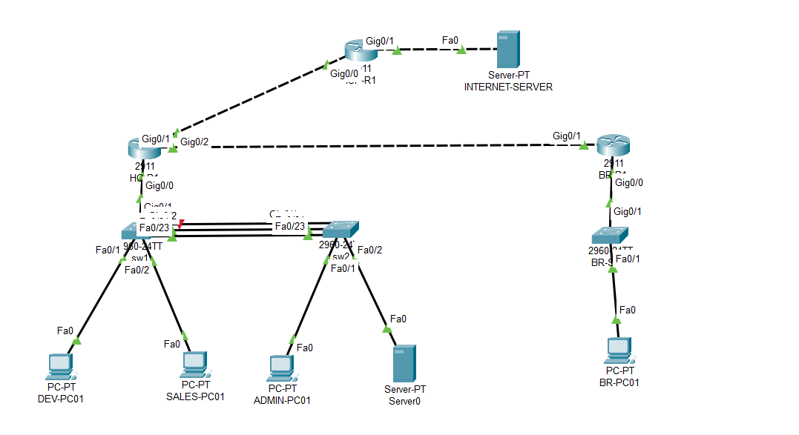

### 구성

- **HQ** : DEV / SALES / ADMIN / SERVER / MGMT
- **Branch** : 지사 사용자망
- **HQ ↔ Branch** : OSPF Dynamic Routing
- **HQ ↔ ISP** : Default Route + NAT/PAT
- **HQ 내부** : Router-on-a-Stick 기반 Inter-VLAN Routing

---

## 2. IP / VLAN Design

| 구분 | VLAN | Network | Gateway |
|---|---:|---|---|
| DEV | 10 | `10.10.10.0/24` | `10.10.10.1` |
| SALES | 20 | `10.10.20.0/24` | `10.10.20.1` |
| ADMIN | 30 | `10.10.30.0/24` | `10.10.30.1` |
| SERVER | 40 | `10.10.40.0/24` | `10.10.40.1` |
| MGMT | 99 | `10.10.99.0/24` | `10.10.99.1` |
| Branch | - | `10.20.10.0/24` | `10.20.10.1` |
| HQ ↔ Branch | - | `172.16.0.0/30` | - |
| HQ ↔ ISP | - | `203.0.113.0/30` | - |
| External | - | `198.51.100.0/24` | - |

본사는 `10.10.x.x`, 지사는 `10.20.x.x`로 주소 영역을 구분하고, 본사 VLAN 번호와 세 번째 Octet을 대응시켜 주소만으로도 네트워크의 역할을 쉽게 파악할 수 있도록 설계했습니다.

> `203.0.113.0/24`, `198.51.100.0/24`는 실제 공인망이 아닌 테스트/문서용 주소 대역이며, Packet Tracer에서 ISP 및 외부망을 모의하기 위해 사용했습니다.

---

## 3. Layer 2

### VLAN / Trunk

DEV, SALES, ADMIN, SERVER, MGMT 네트워크를 VLAN으로 분리했습니다.

802.1Q Trunk를 이용해 여러 VLAN을 스위치와 Router 사이에서 전달하도록 구성했습니다.

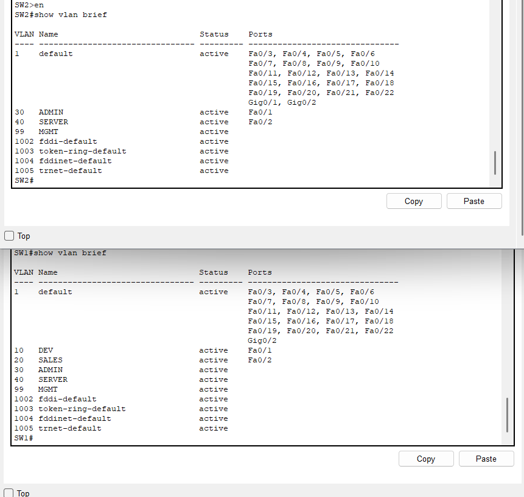

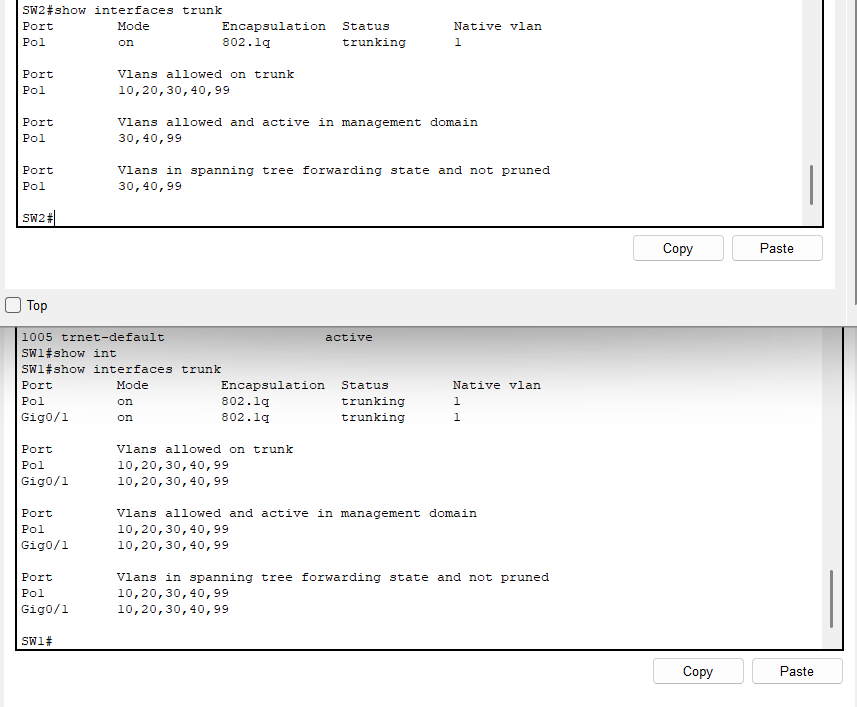

### LACP EtherChannel

SW1과 SW2 사이의 두 물리 링크를 LACP EtherChannel `Po1`으로 구성했습니다.

```text
Fa0/23 ─┐
        ├── Po1
Fa0/24 ─┘
```

정상 상태에서 두 인터페이스가 Port-Channel Member로 참여하는 것을 확인했습니다.

또한 Member Link 하나를 Down시켰을 때 나머지 링크를 통해 통신이 유지되는 것을 검증했습니다.

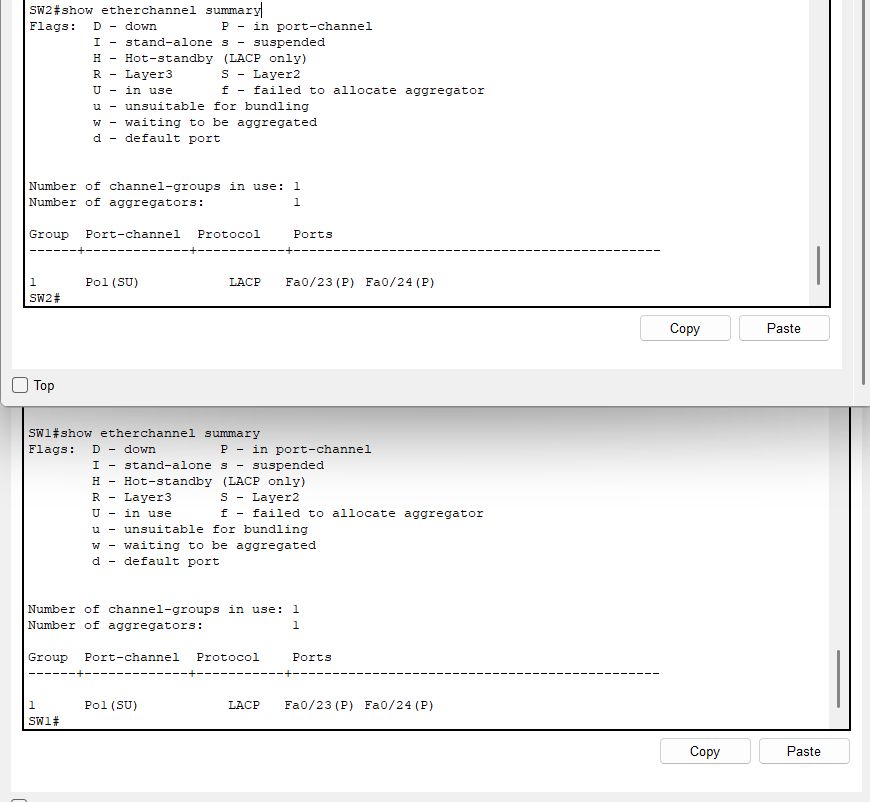

### STP

Layer 2 이중 경로에서 발생할 수 있는 Loop를 방지하기 위해 STP를 적용했습니다.

Primary Path 장애 상황에서 Backup Path가 Forwarding 상태로 전환되는 과정도 확인했습니다.

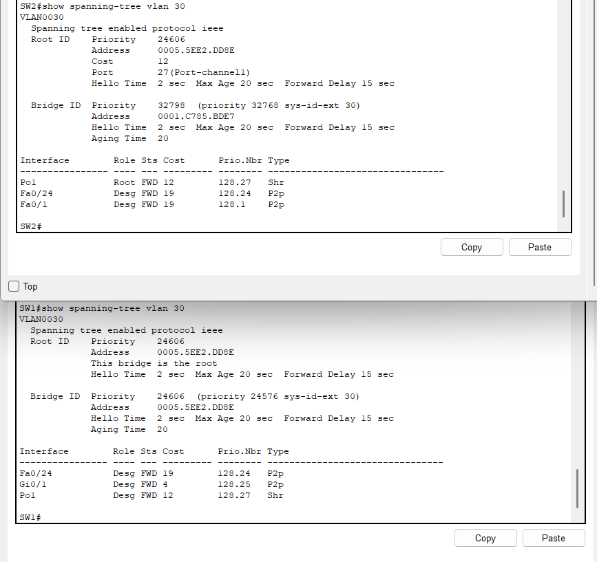

---

## 4. Layer 3 / OSPF

본사 VLAN 간 통신은 HQ-R1의 Subinterface를 이용한 **Router-on-a-Stick** 방식으로 구성했습니다.

본사와 지사 연결은 Static Routing으로 먼저 통신을 검증한 뒤 OSPF Dynamic Routing으로 전환했습니다.

```text
HQ-R1
172.16.0.1/30
     |
     | OSPF Area 0
     |
172.16.0.2/30
BR-R1
```

사용자 VLAN에는 `passive-interface`를 적용하고 실제 Router 간 링크에서만 OSPF Neighbor가 형성되도록 구성했습니다.

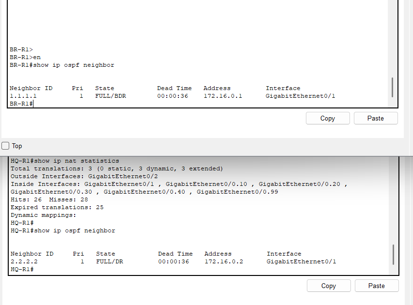

Routing Table에서 상대 Site의 네트워크가 OSPF Route로 학습되는 것도 확인했습니다.

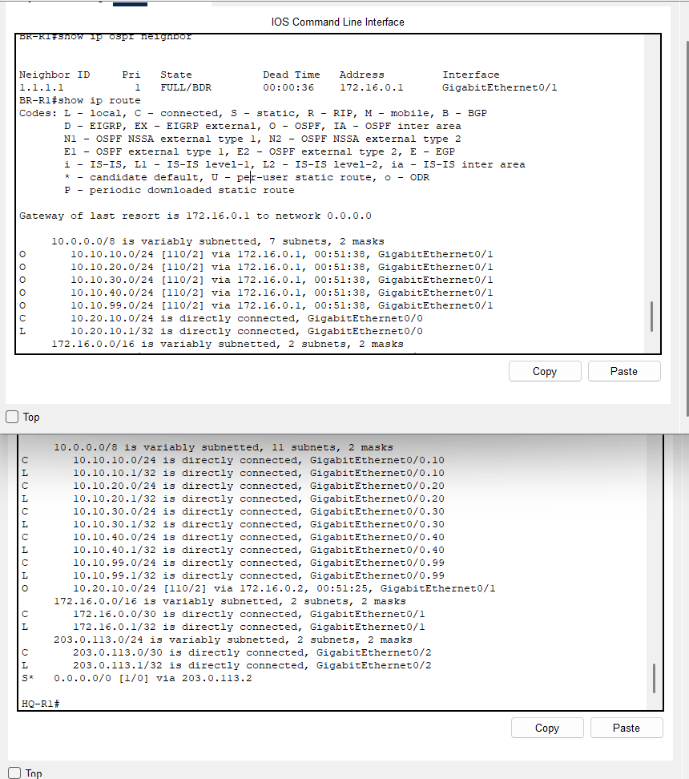

HQ-R1의 Default Route는 다음 설정을 이용해 지사에 광고했습니다.

```cisco
router ospf 1
 default-information originate
```

이를 통해 지사 사용자는 HQ를 경유하여 외부망에 접근합니다.

---

## 5. DHCP / DHCP Relay

SERVER VLAN의 중앙 DHCP Server에서 DEV 및 SALES 사용자에게 IP를 할당하도록 구성했습니다.

서로 다른 VLAN의 DHCP Broadcast를 중앙 DHCP Server로 전달하기 위해 HQ-R1에 DHCP Relay를 적용했습니다.

```cisco
ip helper-address 10.10.40.10
```

DHCP Relay 설정을 제거하여 특정 VLAN에서만 IP 할당이 실패하는 장애도 검증하고 복구했습니다.

---

## 6. NAT / PAT

본사와 지사의 Private IP가 외부망과 통신할 수 있도록 HQ-R1에 PAT를 구성했습니다.

```text
HQ / Branch
Private Network
      |
      v
    HQ-R1
    NAT/PAT
      |
      v
203.0.113.1
      |
      v
    ISP-R1
      |
      v
External Network
```

본사 `10.10.0.0/16`과 지사 `10.20.10.0/24`를 NAT 대상으로 지정했습니다.

`overload`를 적용하여 여러 내부 사용자가 HQ-R1의 외부 인터페이스 주소를 공유하도록 구성했습니다.

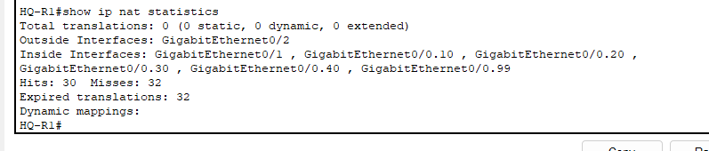

---

## 7. Management / Access Control

### Management VLAN

네트워크 장비 관리 트래픽을 일반 사용자망과 분리하기 위해 VLAN99를 구성했습니다.

| Device | Management IP |
|---|---|
| HQ-R1 | `10.10.99.1` |
| SW1 | `10.10.99.11` |
| SW2 | `10.10.99.12` |

### SSH / VTY ACL

SW1과 SW2에 SSH Remote Management를 구성했습니다.

VTY ACL을 이용하여 지정된 ADMIN-PC `10.10.30.10`에서만 장비에 SSH 접속할 수 있도록 제한했습니다.

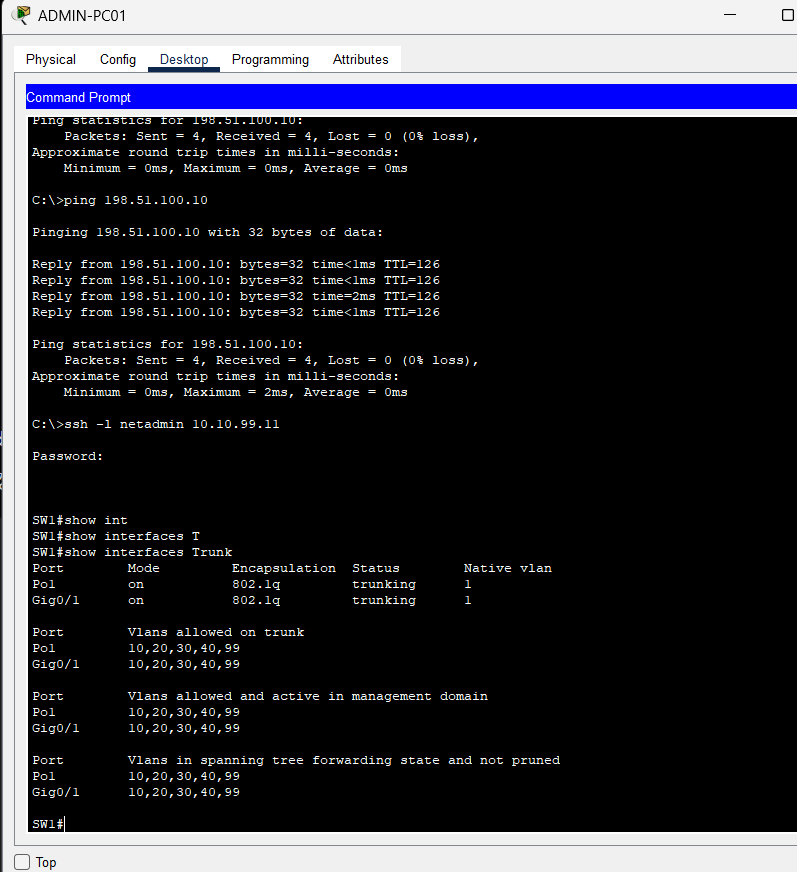

### Extended ACL

사용자 역할에 따라 접근 정책을 분리했습니다.

| Source | SERVER HTTP/HTTPS | SERVER Other | MGMT | Internet |
|---|---:|---:|---:|---:|
| DEV | Allow | Deny | Deny | Allow |
| SALES | Allow | Deny | Deny | Allow |
| ADMIN-PC | Allow | Allow | Allow | Allow |

DEV / SALES / ADMIN 정책은 각 Router Subinterface의 Inbound 방향에 적용했습니다.

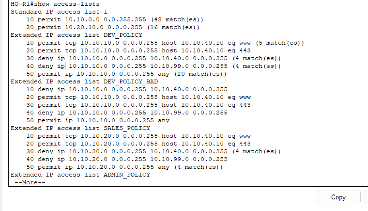

---

## 8. NTP / Syslog

SERVER01을 이용하여 Router 및 Switch의 시간을 동기화하고 중앙 Syslog 환경을 구성했습니다.

EtherChannel Member Port를 Down / Up하여 실제 인터페이스 상태 변경 이벤트가 Syslog Server에 기록되는 것을 확인했습니다.

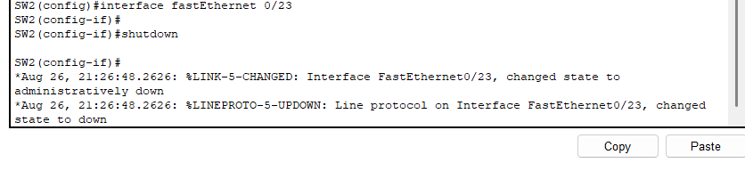

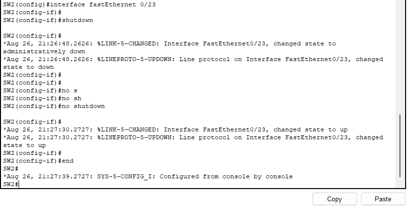

---

## 9. Troubleshooting

정상 네트워크 구축 후 여러 장애를 의도적으로 발생시켜 원인 분석 및 복구를 수행했습니다.

| Incident | Symptom | Root Cause |
|---|---|---|
| Trunk VLAN 누락 | SALES만 전체 통신 실패 | VLAN20 Allowed VLAN 누락 |
| OSPF Area 불일치 | WAN Ping O / Branch 통신 X | OSPF Area 불일치 |
| OSPF Network 누락 | Neighbor FULL / 특정 Route 없음 | Network Statement 누락 |
| DHCP Relay 누락 | 특정 VLAN만 DHCP 실패 | `ip helper-address` 누락 |
| NAT ACL 누락 | Branch 내부통신 O / Internet X | Branch 대역 NAT 대상 누락 |
| NAT Outside 누락 | Router Internet O / 사용자 Internet X | `ip nat outside` 누락 |
| ACL Rule Order | 허용된 HTTP 서비스 차단 | 상위 Deny Rule 선매칭 |
| ACL 적용 누락 | SALES → MGMT 접근 가능 | Interface ACL 미적용 |
| LACP 불일치 | Po1 Down / Member Individual | LACP Mode 불일치 |
| STP Backup 장애 | Primary 장애 후 Failover 실패 | Backup Interface Shutdown |

### Troubleshooting Approach

```text
증상 확인
   ↓
영향 범위 확인
   ↓
정상 구간 제거
   ↓
장비 상태 확인
   ↓
Root Cause 확인
   ↓
최소 범위 설정 수정
   ↓
End-to-End 재검증
```

장애 발생 시 설정부터 변경하기보다 정상적으로 동작하는 구간을 먼저 확인하여 장애 범위를 단계적으로 좁히는 방식으로 접근했습니다.

---

## 10. Verification Commands

장애 분석 및 최종 검증 과정에서 다음 명령을 주로 사용했습니다.

```cisco
show interfaces status
show vlan brief
show interfaces trunk
show etherchannel summary
show spanning-tree vlan 30

show ip interface brief
show ip route
show ip ospf neighbor

show access-lists
show ip nat translations
show ip nat statistics
```

---

## 11. Repository Structure

```text
.
├── README.md
├── ABC_Tech_Enterprise_Network_Final.pkt
│
├── configs/
│   ├── BR-R1.txt
│   ├── BR_SW1.txt
│   ├── HQ_R1.txt
│   ├── ISP_R1.txt
│   ├── SW1.txt
│   └── SW2.txt
│
└── pic/
    ├── acl.png
    ├── etherchannel.png
    ├── nat.png
    ├── ospf_neighbor.png
    ├── routing.png
    ├── ssh.png
    ├── stp.png
    ├── syslog.png
    ├── syslog2.png
    ├── topology.png
    ├── trunk.png
    └── vlan.png
```

---

## 12. What I Learned

VLAN, Routing, DHCP, NAT, ACL 등의 기능이 각각 독립적으로 동작하는 것이 아니라 End-to-End 통신 과정에서 서로 연결되어 있다는 점을 확인했습니다.

특히 OSPF Neighbor가 `FULL` 상태여도 특정 Network Statement가 누락되면 해당 Route가 학습되지 않고, ACL이 정의되어 있더라도 인터페이스에 적용되지 않으면 실제 정책으로 동작하지 않는다는 것을 장애 실습을 통해 확인했습니다.

정상망 구축뿐 아니라 의도적으로 장애를 발생시키고, 정상 구간을 제거하면서 Root Cause의 범위를 단계적으로 좁혀가는 문제 해결 과정을 반복했습니다.

---

## Files

- `ABC_Tech_Enterprise_Network_Final.pkt` : 최종 Packet Tracer 프로젝트
- `configs/` : Router / Switch 최종 Running Configuration
- `pic/` : 구축 및 검증 결과 이미지
